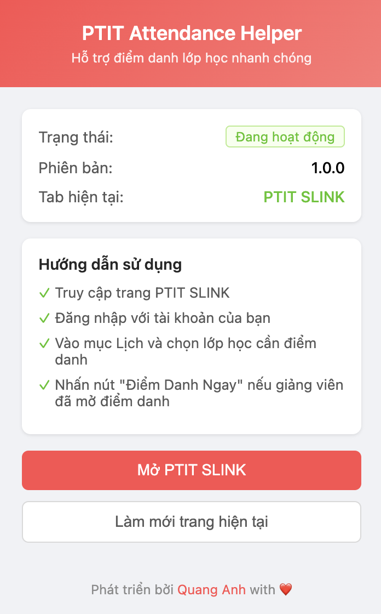
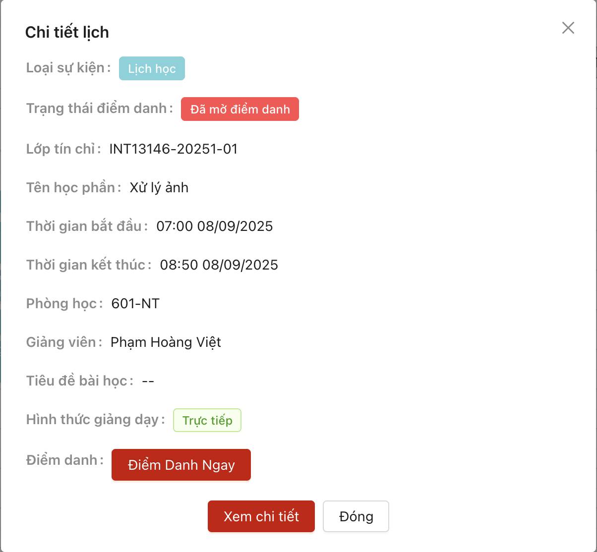
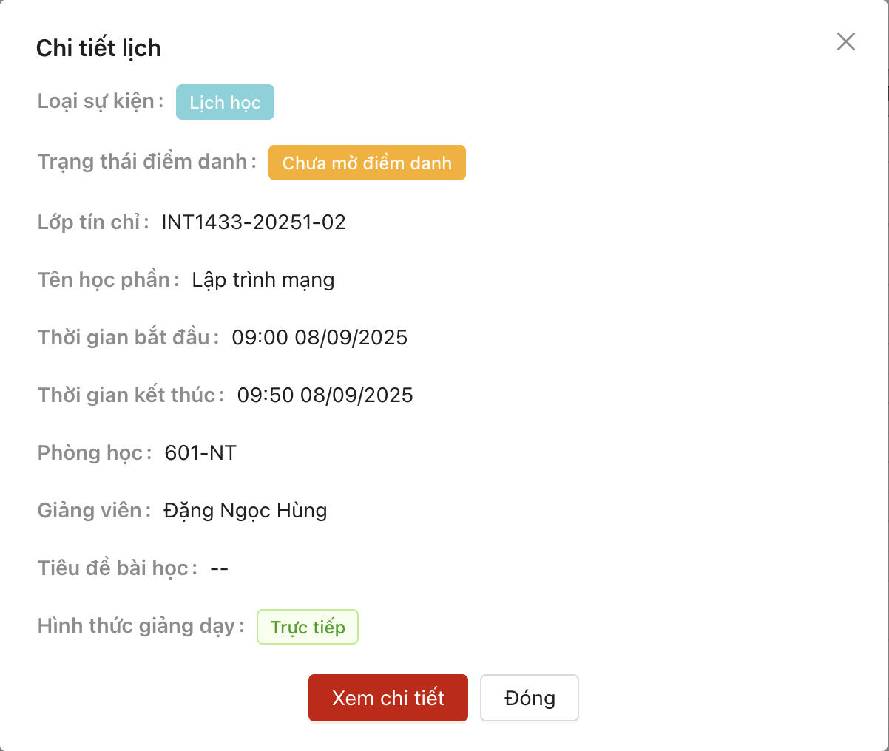

# PTIT Attendance Helper

Extension hỗ trợ điểm danh nhanh chóng cho sinh viên PTIT trên hệ thống SLINK.

## 📋 Tính năng

- ✅ Hỗ trợ điểm danh nhanh chóng không cần quét mã QR
- ✅ Tích hợp trực tiếp vào giao diện PTIT SLINK
- ✅ Hiển thị trạng thái điểm danh của lớp học
- ✅ Giao diện thân thiện, dễ sử dụng
- ✅ Bảo mật - không lưu trữ thông tin đăng nhập

## 📸 Screenshots

### Giao diện Extension Popup

_Giao diện popup của extension khi click vào icon trên thanh công cụ_

### Chi tiết lớp học với nút Điểm Danh

_Modal chi tiết lớp học với nút "Điểm Danh Ngay" được thêm bởi extension_

### Chi tiết lớp học khi chưa mở điểm danh

_Modal chi tiết lớp học khi giảng viên chưa mở điểm danh_

## 🔧 Yêu cầu

- Trình duyệt Chrome, Edge, Brave hoặc các trình duyệt hỗ trợ Chromium
- Tài khoản sinh viên PTIT đã được cấp

## 📦 Cài đặt

### Bước 1: Tải extension

1. Tải toàn bộ thư mục `ptit-attendance-extension` về máy
2. Giải nén nếu cần thiết

### Bước 2: Cài đặt extension vào trình duyệt

#### Chrome/Edge:

1. Mở trình duyệt và truy cập `chrome://extensions/` (Chrome) hoặc `edge://extensions/` (Edge)
2. Bật chế độ **Developer mode** (Chế độ nhà phát triển) ở góc trên bên phải
3. Click vào nút **Load unpacked** (Tải tiện ích đã giải nén)
4. Chọn thư mục `ptit-attendance-extension` vừa tải về
5. Extension sẽ xuất hiện trong danh sách và được kích hoạt tự động

#### Brave:

1. Mở `brave://extensions/`
2. Làm theo các bước tương tự như Chrome

## 📖 Hướng dẫn sử dụng

### Điểm danh lớp học:

1. **Đăng nhập PTIT SLINK:**

   - Truy cập https://slink.ptit.edu.vn
   - Đăng nhập với tài khoản sinh viên

2. **Chọn lớp học cần điểm danh:**

   - Vào mục **Lịch** trên menu
   - Chọn lớp học cần điểm danh từ danh sách

3. **Thực hiện điểm danh:**
   - Extension sẽ tự động kiểm tra trạng thái điểm danh
   - Nếu giảng viên đã mở điểm danh, nút **"Điểm Danh Ngay"** sẽ xuất hiện
   - Click vào nút để điểm danh
   - Chờ thông báo xác nhận

### Kiểm tra trạng thái:

- Click vào icon extension trên thanh công cụ để xem:
  - Trạng thái hoạt động của extension
  - Tab hiện tại đang mở
  - Hướng dẫn sử dụng nhanh

## ⚠️ Lưu ý quan trọng

- Extension chỉ hoạt động trên trang https://slink.ptit.edu.vn
- Cần đăng nhập trước khi sử dụng tính năng điểm danh
- Điểm danh chỉ khả dụng khi giảng viên đã mở điểm danh cho lớp
- Thời gian điểm danh phụ thuộc vào quy định của giảng viên

## 🛠️ Xử lý sự cố

### Extension không hoạt động:

- Kiểm tra đã cài đặt đúng cách chưa
- Reload lại trang PTIT SLINK (F5)
- Tắt và bật lại extension trong trang quản lý extensions

### Không thấy nút điểm danh:

- Đảm bảo đã đăng nhập PTIT SLINK
- Kiểm tra giảng viên đã mở điểm danh cho lớp chưa
- Vào đúng mục Lịch và chọn đúng lớp học
- Thử làm mới trang (F5)

### Điểm danh thất bại:

- Kiểm tra kết nối internet
- Đảm bảo token đăng nhập còn hiệu lực
- Thử đăng xuất và đăng nhập lại PTIT SLINK

## 🔄 Cập nhật

Để cập nhật extension:

1. Tải phiên bản mới
2. Thay thế thư mục cũ
3. Vào trang extensions và click nút reload (↻)

## 🔒 Bảo mật

- Extension **KHÔNG** lưu trữ thông tin đăng nhập
- Sử dụng token có sẵn từ session của PTIT SLINK
- Mọi request được gửi trực tiếp đến server PTIT
- Mã nguồn mở, có thể kiểm tra tại thư mục extension

## 📝 Changelog

### Version 1.0.0 (Current)

- Tính năng điểm danh nhanh không cần QR
- Tích hợp trực tiếp vào SLINK
- Giao diện popup với hướng dẫn sử dụng
- Hiển thị trạng thái điểm danh

## 👤 Tác giả

Phát triển bởi **[Quang Anh](https://github.com/quanganh208)** with ❤️

## 📄 License

Extension này được phát triển cho mục đích học tập và hỗ trợ sinh viên.

## ⚖️ Miễn trừ trách nhiệm

Extension này được phát triển cho mục đích học tập và hỗ trợ sinh viên. Người dùng tự chịu trách nhiệm về việc sử dụng extension phù hợp với quy định của nhà trường. Tác giả không chịu trách nhiệm về bất kỳ hậu quả nào từ việc sử dụng extension này.
